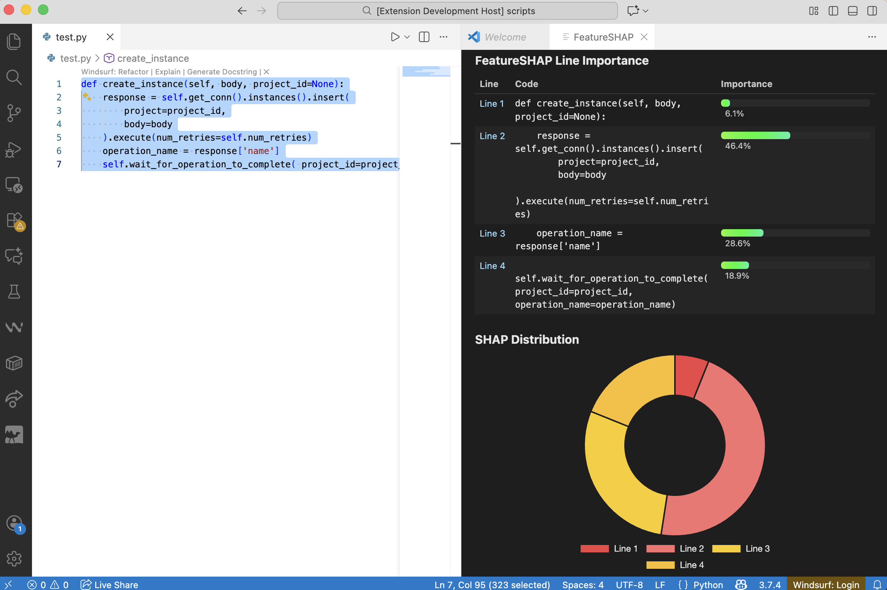

# FeatureSHAP VS Code Explainer

A Visual Studio Code extension that visualizes SHAP-style feature attributions for code selections using an interactive WebView interface. This project provides a frontend for exploring line-level importance values returned by a backend SHAP server (currently stubbed with simulated values). The extension is structured to seamlessly integrate with the full FeatureSHAP model in future iterations.

---

## 📁 Project Structure

```
vscode-shap-explainer/
├── .vscode/                 # VS Code workspace settings
├── scripts/
│   ├── server.py           # FastAPI backend stub serving random SHAP values
│   └── test.py             # Test script for backend
├── shap_model/             # Placeholder for future FeatureSHAP integration
├── src/
│   ├── test/               # Extension test files
│   └── extension.ts        # Main extension entry point
├── webview/
│   ├── webview.html        # WebView HTML template
│   └── webview.js          # Frontend logic for table + chart visualization
├── README.md               # (This file)
```

---

## Features

### Line-Level SHAP Visualization
- Displays each selected line of code with:
  - Line number
  - Code text (monospace rendering)
  - Computed percent contribution
  - A gradient bar visualizing importance

### Interactive Doughnut Chart
- Shows global attribution distribution across selected lines
- Hover and slice expansion effects
- Values match the table for ease of comparison

### Responsive WebView UI
- Styled to match VS Code’s dark theme
- Scrollable layout supporting large code selections
- Smooth CSS transitions and Chart.js rendering

### Modular Client–Server Architecture
- VS Code extension acts as frontend
- FastAPI backend stub returns simulated SHAP values
- Ready for integration with real FeatureSHAP backend

---

## Getting Started

### Install Dependencies

**Frontend**
```bash
npm install
```

**Backend**
```bash
pip install fastapi uvicorn pydantic
```

---

### Run the Backend Server

```bash
python scripts/server.py
```

This starts a FastAPI server on:

```
http://127.0.0.1:5005/shap
```

---

### Launch the Extension

Open the project in VS Code, then:

1. Press **F5** to open the Extension Development Host
2. Highlight any code in a file
3. Open the Command Palette (`Ctrl/Cmd + Shift + P`)
4. Run **FeatureSHAP: Compute SHAP for Selection**

A WebView panel appears beside the editor showing:
- Line importance table  
- Doughnut chart  

---

## Example UI

Below is a sample output generated by the extension:



---

## Future Work

- Integration with the real FeatureSHAP model
- Token-level or AST-level visualizations
- Comparison mode for multiple SHAP runs
- Persistent WebView panel for repeated analysis
- Improved error messaging and backend diagnostics

---

## License

MIT License.  
Feel free to adapt and modify for research or educational purposes.

---

## Contact

For questions:

**Tejal Nair**  
Cornell University / William & Mary  
AI for Software Engineering course  
